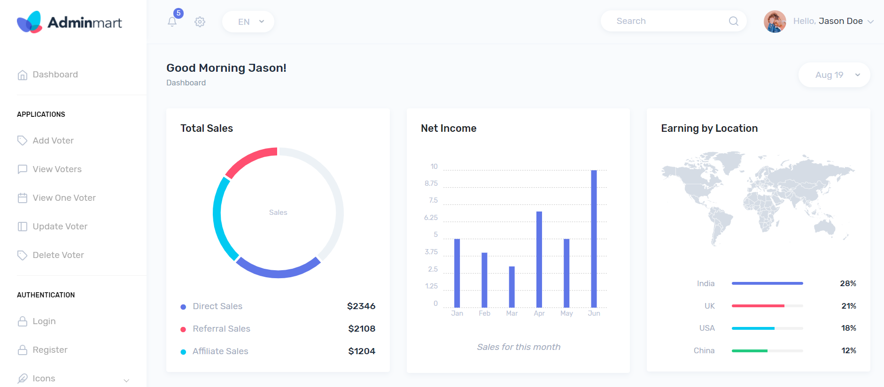
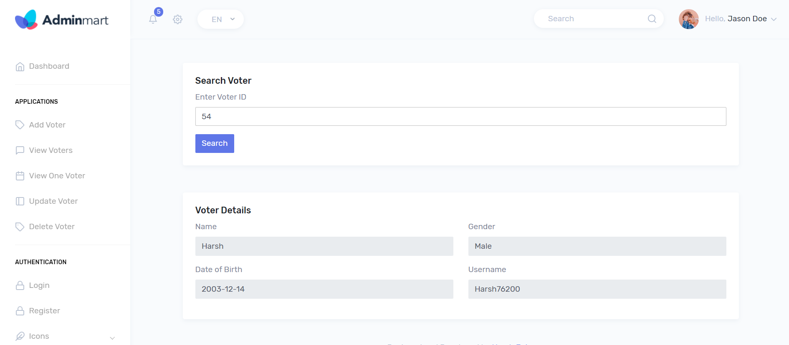
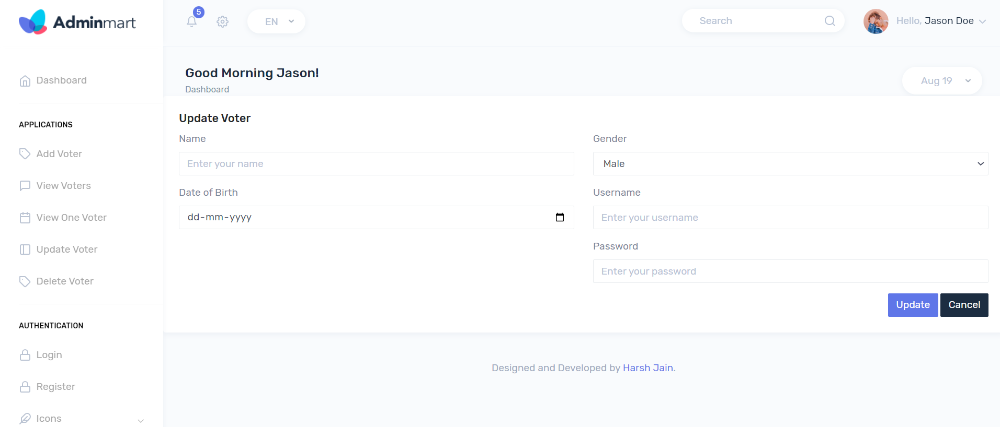

# Voter Management System 🗳️

## Project Overview

The Voter Management System is a comprehensive web-based application designed to streamline the process of managing voter information. It provides functionalities for admin and voter management, including registration, authentication, and profile management. This system is built using modern technologies and follows best practices for security and scalability. 🚀

## Screenshots

Here are some screenshots of the Voter Management System:








## Project Objectives

- **Admin Management**: 🛠️
  - Allow admins to register, login, and manage voter information.
  - Provide functionalities for updating voter details, viewing all voters, and searching for specific voters.

- **Voter Management**: 🗳️
  - Enable voters to register and update their profiles.
  - Allow voters to securely log in and access their personal information.

- **Security**: 🔒
  - Implement robust authentication and authorization mechanisms to ensure data privacy and system security.
  - Encrypt sensitive information such as passwords.

- **User-Friendly Interface**: 💻
  - Design an intuitive and responsive user interface for both admins and voters.
  - Provide clear feedback and error messages to guide users through various actions.

- **Scalability**: 📈
  - Build a scalable system that can handle an increasing number of users and data efficiently.

- **Data Integrity**: ✅
  - Ensure the accuracy and consistency of voter information through validation and error-checking mechanisms.

- **Reporting**: 📊
  - Generate reports on voter data to provide insights and support administrative decisions.

## Technologies Used

- **Frontend**: HTML, CSS, Bootstrap, JS 🌐
- **Backend**: Java, Spring Boot ☕
- **Database**: MySQL 💾
- **Authentication**: Spring Security 🔐
- **Version Control**: Git & GitHub 🧑‍💻
- **Deployment**: Docker, Heroku 📦

## Setup and Installation

### Prerequisites

- Java 11 or higher ☕
- Maven 🛠️
- MySQL 💾
- Docker (optional, for containerization) 🐳

### Setup Instructions

1. **Clone the Repository**: 
   ```bash
   git clone https://github.com/Harsh76200/voter-management-system.git
   cd voter-management-system

2. **Configure the Database**:
    - Create a PostgreSQL database and user for the application.
    - Update the `application.properties` file with your database credentials:
      ```properties
      spring.datasource.url=jdbc:postgresql://localhost:5432/voter_db
      spring.datasource.username=your_username
      spring.datasource.password=your_password
      ```

3. **Build the Application**:
    ```bash
    mvn clean install
    ```

4. **Run the Application**:
    ```bash
    mvn spring-boot:run
    ```
    Alternatively, if you are using Docker:
    
    - **Build the Docker Image**:
      ```bash
      docker build -t voter-management-system .
      ```
    
    - **Run the Docker Container**:
      ```bash
      docker run -p 8080:8080 voter-management-system
      ```

5. **Access the Application**:
    Open your browser and navigate to `http://localhost:8080` to access the Voter Management System.

## Usage

- **Admin Login**: Access the admin dashboard by logging in with your admin credentials.
- **Voter Registration**: Register as a new voter or update your existing information.
- **Search and View Voters**: Use the search functionality to find and view voter details.

## Contribution

Feel free to contribute to this project by submitting issues or pull requests. Please follow the guidelines outlined in the `CONTRIBUTING.md` file.


## Contact

For any questions or feedback, please contact Harsh Jain.
